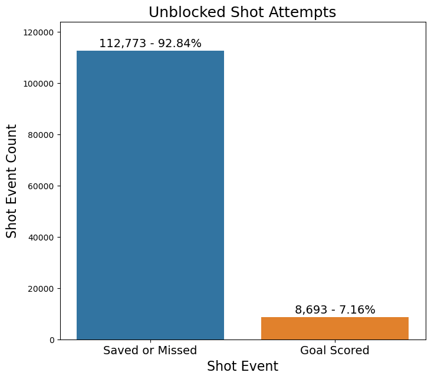
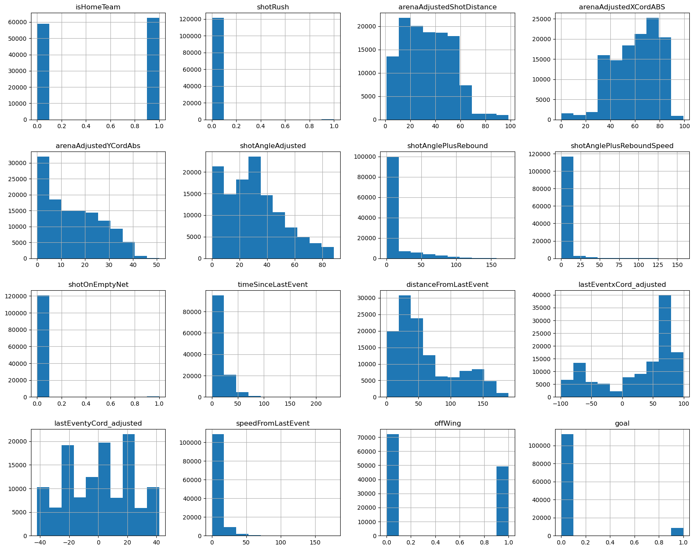
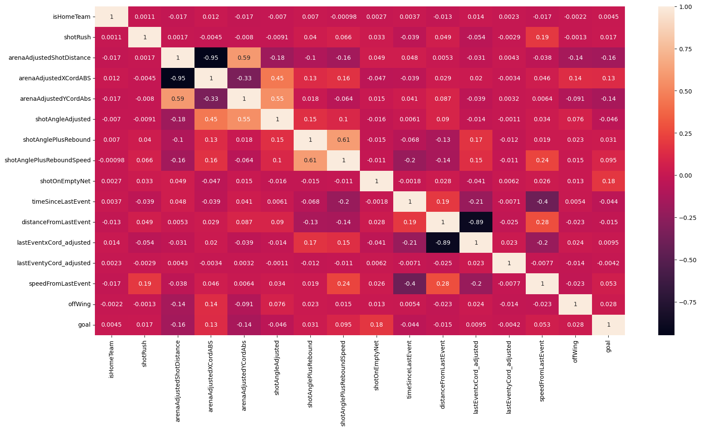
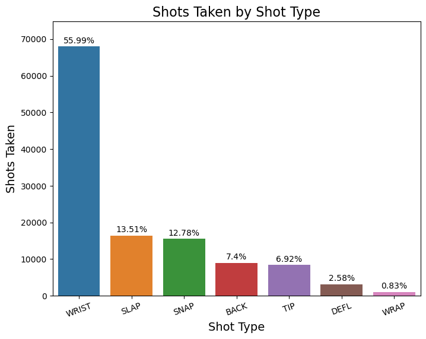
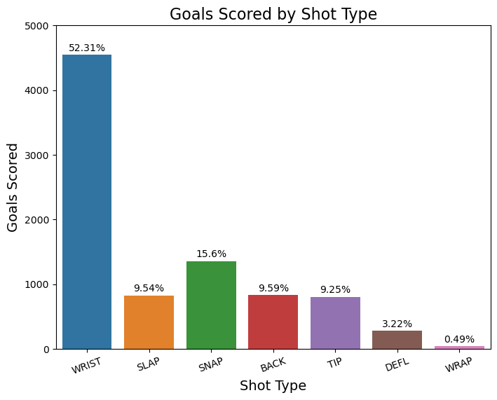
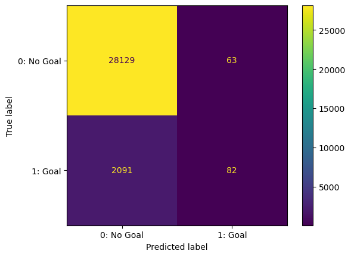
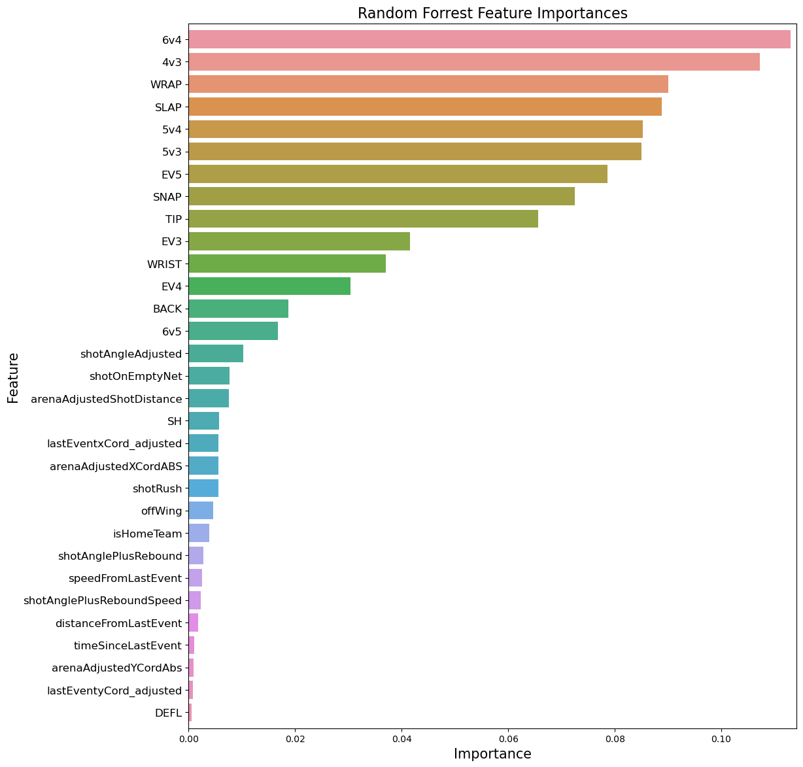
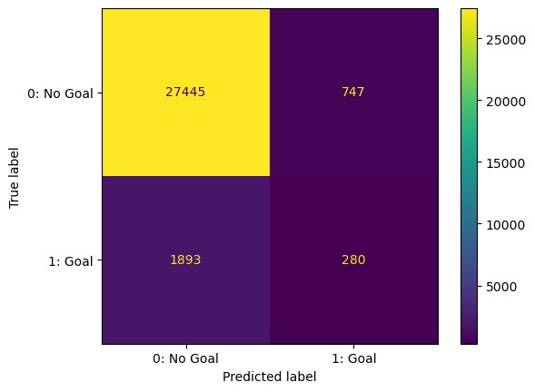
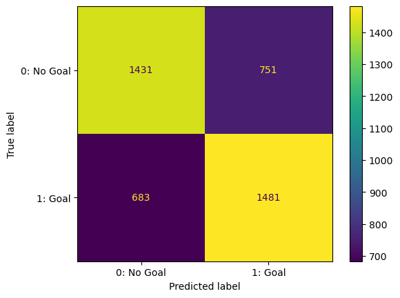
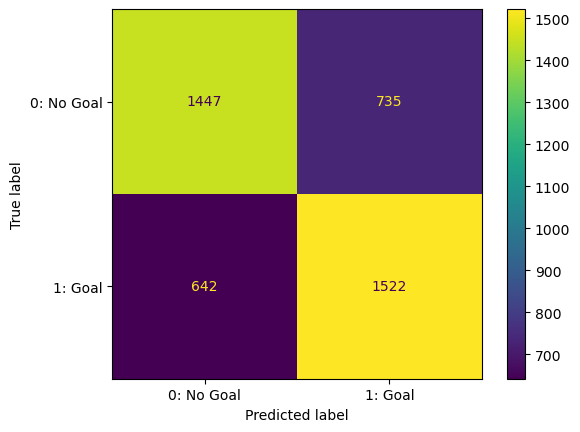

# Modeling Expected Goals in the NHL

Building a binary classification model to value shots in the NHL.

## Overview

The purpose of an expected goals (xG) models is to estimate the value of any given shot taken. Understanding that shots do not have a uniform chance of scoring, xG models leverage a variety of numeric and categorical data to create valuations for individual shots. The value assigned to a given shot is the probability it results in a goal.

While the model itself is an estimator of shot quality, shot quantity is also an important feature in determining expected goals. For a given time period, the total expected goals is sum of all the individual shot xG values. e.g. The sum of a player's individual xG values for a game is that player's total xG generated for the game, and adding in the totals for each teammate results in the team's expected goals for the game.

## Business and Data Understanding

### Stakeholders & Business Problem

- Many NHL teams are still resistant to using advanced analytics despite the quality and quantity of game data greatly improving in recent years
- Reliance on older, less advanced metrics such as simply counting shot volume puts coaching and front office staffs at a disadvantage
- Our firm, Hockey Data LLC, has been contracted by an NHL team to build them an xG model 
- Our goal in building this model is to provide stakeholders with a tool to better evaluate past results and predict future performance
- Understanding how many goals individuals and teams as a whole can be expected generate can provide insight and drive strategic decision making in numerous ways:
  - Front offices can use it when evaluating players they are considering signing and valuing contracts during negotiations
  - Coaches can use it to help optimize their own lineups and to better understand a given opponents' game and plan adjustments accordingly
  - Players can use it to better understand their own performance and gain insights into how they can tweak their own game to produce better individual and in turn team results

### Data Understanding

Source and Methodology

- Data is comprised of individual shot data from the 2021-2022 NHL season
- Shot data was sourced from [moneypuck.com](https://moneypuck.com/data.htm)
  - Moneypuck shot data tracks 124 features for each individual shot instance
  - Data is compiled by scraping the ESPN and NHL websites
  - Includes additional metrics derived from scraped league data
- All unblocked, "Fenwick", shots are included in our analysis
  - Blocked shots are not included, as the NHL records the location of the player blocking a shot instead of where the shot was taken for blocks
- Feature set include variables such as shot type, shot location, game strength state (i.e. is the shooting team on a powerplay)
- The target variable is Goal
  - This problem is treated as binary classification as we want to know the probability of any given shot to go in (1) or not (0)

Prior to modeling, EDA was performed to identify any potential issues and preprocessing requirements

- Target variable distribution
  <!--  -->
  

  - Our target variable is highly imbalanced
  - This imbalance will have to be addressed with sampling techniques during our modeling

- Numeric feature distribution
  <!--  -->
  

  - There is a mix of binary and continuous non-normally distributed features in the data
  - StandardScalar will be used to normalize these features for modeling

- Numeric feature correlation
  <!--  -->
  

  - There aren't any numeric features which immediately stand out as being highly correlated
  - We will incorporate some categorical variables to see if they have more predictive power

- Handling categorical variables
  - Shot type is likely an important feature

 


These values will have to be one hot encoded for modeling

- Man up/down situations also certainly play a role in expected goal generation
  - We use data detailing the number of players on the ice at the time of a shot event to compute a game strength state feature
  - Each row was imputed with one of the 9 different strength states for even strength, powerplay, and penalty kil situations

## Modeling

### Overview

To handle this binary classification problem, we trained and tested several different models. Various hyperparameters for each model were tuned in order to optimize performance. Pipelines were constructed to handle categorical and numerical features to ensure workflow integrity and reproducibility.

### Models

Basic logistic regression

- We deployed an out of the box logistic regression model to serve as our baseline
- Scoring:
  - Test accuracy: 0.93
  - Test AUC-ROC score: 0.756
  - Test log loss score: 0.228
  

Random Forest Model

- We deployed an out of the box RandomForestClassifier model next
- The scores were similar to that of the basic logistic regression
- We leveraged RandomForestClassifier module to look at the importances of our features
  

Random Forest Model w/ SMOTE

- Using SMOTE to oversample the minority class improved our ability to correctly predict goals
- However we traded a lot of false negatives for false positives
- Log loss jumped to .3
  

Random Forest using data subset

- Since SMOTE did not improve results to our liking, we decided to employ a different sampling solution
- Took a subset of ‘No Goal’ shots = to the number of shots which scored a goal
- Scoring:
  - Test accuracy: 0.67
  - Test AUC-ROC score: 0.737
  - Test log loss score: 0.601
- While our ability to correctly classify true positive outcomes significantly improved, log loss doubled
  

Cross Validated Logistic Regression Cross Validation on the subset

- Deployed GridSearchCV to optimize logistic regression models
- Scoring:
  - Test accuracy: 0.68
  - Test AUC-ROC score: 0.756
  - Test log loss score: 0.586
- Marginal improvements over the previous attempt with random forest
  

### Evaluation

The metrics used to evaluate our models are AUC-ROC and log loss

- Both AUC-ROC and log loss are common metrics used to score classification models
- Generally, the closer AUC-ROC is to 1 and the closer log loss is to 0 the better
- AUC-ROC measures the models ability to correctly classify our targets
- Log loss measures how close the model's predictions are to the actual labels - i.e. the model's predictive power
- Given the imbalanced nature of the data, we are using both metrics to check for instances where one type of quality is being sacrificed for another
- From our research, industry benchmarks for the scores are as follows:
  - ROC-AUC score >= .77
  - Log loss =< .20

## Conclusion

### Observations

- Modeling publicly available data can provide actionable insight for coaches and players, but there is room for improvement
- Only our basic tests achieved scores in line with our benchmark
  - Despite scoring well, those models struggled with predicting true positives
- More work needs to be done to reduce the number of false negatives
- While subsetting the data produced decent results, log loss jumped significantly
  - Such high levels of log loss call the predictive capability of those models into question

### Future Recommendations

- Use several years worth of data
  - If this prevents us from having to subset the sample data, it should allow us to maintain acceptable log loss levels 
- Revisit feature selection
- Construct separate models for different game strength classes 
  - Different strengths dominates feature importance, but majority of game is played even strength
  - Feature importance might differ between states
- Use team proprietary data
  - Introduce other features public data does not account for
  - Proprietary data could well be better than league data and provide an edge

## Repo Structure

```
├── imgs
├── .gitignore
├── NHL-Expected-Goals-Notebook.pdf
├── NHL-Expected-Goals-Presentation.pdf
├── NHL-Expected-Goals.ipynb
└── README.md
```
